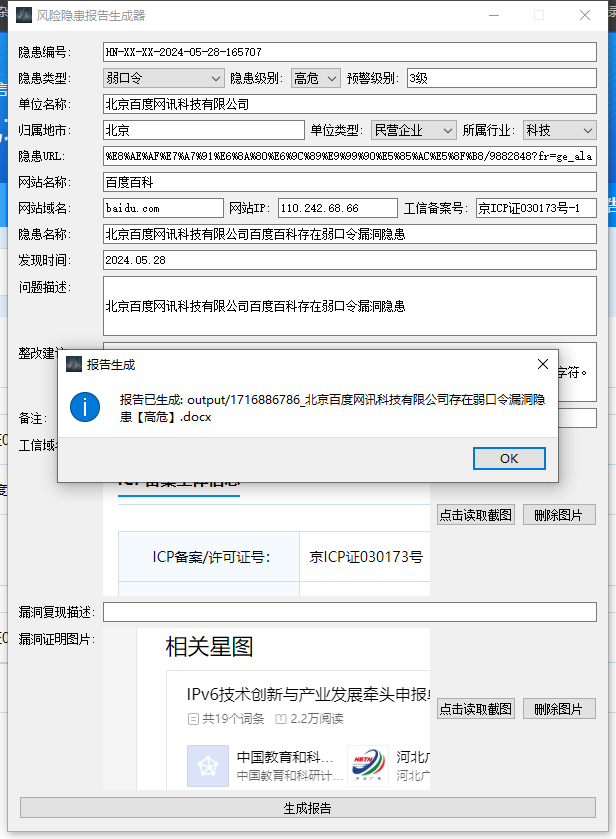
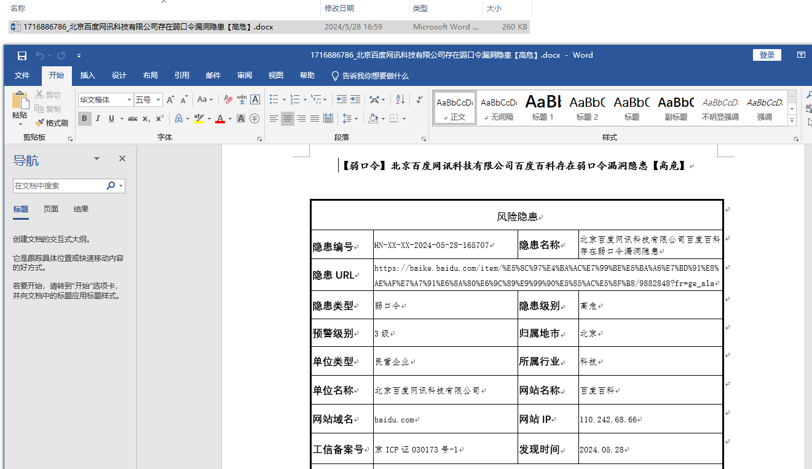
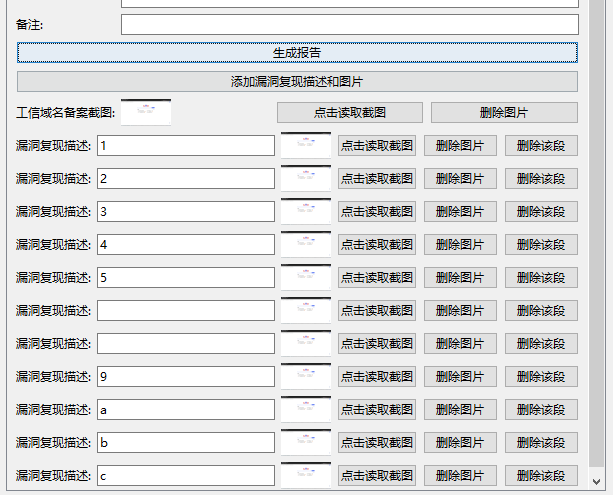
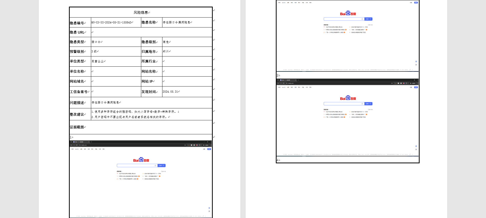

# 简介

基于[Coderrrr-400](https://github.com/Coderrrr-400/XhitReport) 师傅项目二开，也是`pyqt+chatgpt`练手项目。

# 背景

在试用多款渗透测试报告生成工具后终于放弃了，每个项目在安装或使用的过程中都存在一些瑕疵。


如果仅在乎报告而不在乎格式的话，每一款似乎都不错，各有千秋，遗憾的是都无法做到完全匹配正在使用的模板。也想过对其中一些项目进行二开，但对于菜鸡的我来说难度也偏大，对比之下只有Coderrrr-400师傅的项目对我来说比较简单直接，可塑性较强。虽然不会pyqt，但在chatgpt和google的辅助之下二开项目还是达到预期。

## 配置

`pip3 install requirements.txt`

`config.yaml`

```
supplierName: '张三'
city: '郑州'  # 自定义默认城市
unitType:
industry:
```

漏洞名称及修复建议配置格式，换行的目的是为了在word中也能换行

```
vulnerabilities:
  弱口令: 
    1.使用多种字符组合的强密码，如大小写字母+数字+特殊字符。

    2.用户密码中不要出现与用户名或者系统名相关的字符。
```
或
```
vulnerabilities:
  弱口令: '1.使用多种字符组合的强密码，如大小写字母+数字+特殊字符。

    2.用户密码中不要出现与用户名或者系统名相关的字符。'
```

## 基础测试

> 注: 图中所示为随便复制的测试数据，非实际漏洞



## 基础输出

### xxx.docx



### log.txt

`output/2024.05.28_output.txt`


直接全选复制到excel表格中


## 测试漏洞复现多图文



结果


