# 简介

基于[Coderrrr-400](https://github.com/Coderrrr-400/XhitReport) 师傅项目二开，也是`pyqt+chatgpt`练手项目。

# 背景

在试用多款报告生成工具后终于放弃了，每个项目在安装或使用的过程中都存在一些瑕疵。

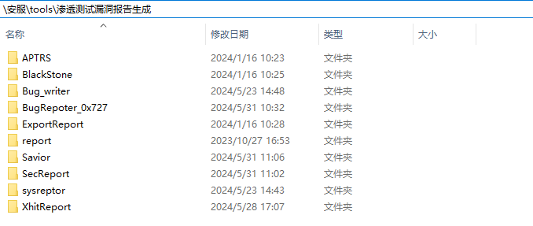

如果只关注报告而不关注格式，每个选项似乎都不错，各有千秋。遗憾的是，它们都无法完全匹配正在使用的模板。我曾考虑对其中一些项目进行二次开发，但对于我这个初学者来说，难度太大了。相比之下，Coderrrr-400师傅的项目对我来说比较简单直接，也更加可塑。虽然我不懂pyqt，但在chatgpt和Google的帮助下，二次开发的项目还是达到了预期效果。

# 配置


`config.yaml`

```
report_Template: 'config/demo.docx'
vulnerability_List: 'config/web漏洞合集描述和修复建议.xlsx'
ICP_List: 'config/ICP备案信息.xlsx'
supplierName: '张三'
city: '北京'
```

`web漏洞合集描述和修复建议.xlsx`

- 必须包含漏洞名称、漏洞描述、修复建议这三个表头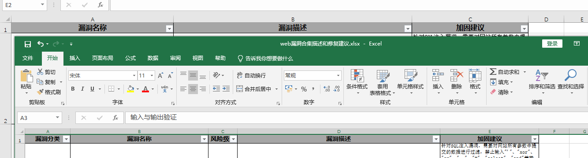

  除此之外的表头都无所谓

`ICP备案信息.xlsx`

- 必须包含unitName(单位名称)、domain(根域名)、serviceLicence(备案号)

  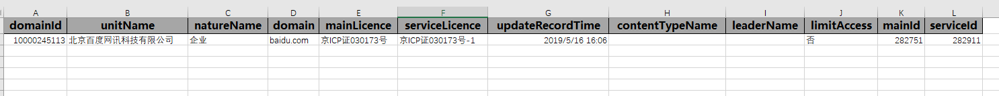

- 数据来源

  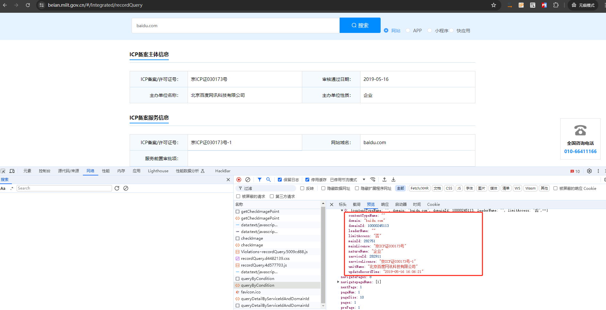

  可以使用 [ICP_Query_Batch](https://github.com/s1g0day/ICP_Query_Batch) 进行自动提取

# 启动

该项目适用于 `python3.*` ，已验证:

- 开发：3.11.4
- 测试：3.8.6

1、安装模块

```
pip3 install -r requirements.txt
```

2、启动GUI

```
python3 ShitReport.py
```

3、偷个懒使用start.bat

```
@echo off
rem 隐藏黑色窗口
if "%1"=="h" goto begin 
mshta vbscript:createobject("wscript.shell").run("%~nx0 h",0)(window.close)&&exit 
:begin 

REM 检查Python的安装路径
set PYTHON=python
set PYTHON3=python3

REM 优先使用Python3
if exist %PYTHON3% (
    set PYTHON=%PYTHON3%
)

REM 使用Python运行demo.py
%PYTHON% ShitReport.py

REM 检查是否成功运行
if %ERRORLEVEL% neq 0 (
    echo Failed to run ShitReport.py
    pause
    exit /b 1
)

echo Successfully ran ShitReport.py
pause
exit /b 0

```

> 注: 如果使用start.bat的话，有两点需要注意:

- 我们的电脑可能会安装python2和python3两个版本，需要注意默认`PYTHON=python`调用的版本，如果`2版本`的话就无法启动
- 也要保证已经配置合适的环境变量

```
C:\Users\test>python2 -V
Python 2.7.18

C:\Users\test>python3 -V
Python 3.11.4

C:\Users\test>python -V
Python 3.11.4

C:\Users\test>path
PATH=D:\python\3;D:\python\2;D:\python\3\Scripts;D:\python\2\Scripts;
```

## 基础测试

> 注: 图中所示为随便复制的测试数据，非实际漏洞

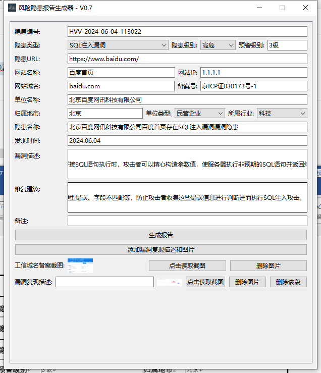

## 基础输出

### xxx.docx

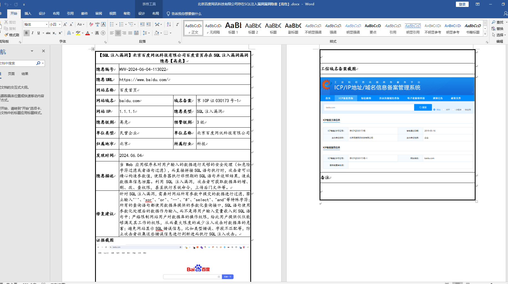

### log.txt

`output/2024.05.28_output.txt`

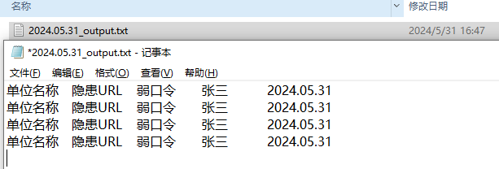

直接全选复制到excel表格中

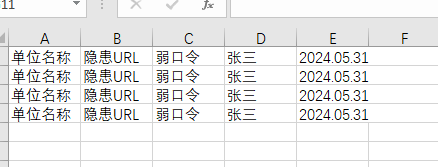

## 漏洞复现多图文

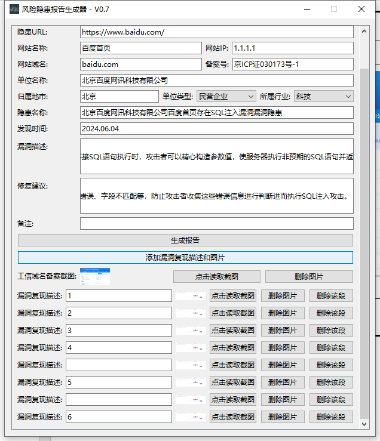

结果

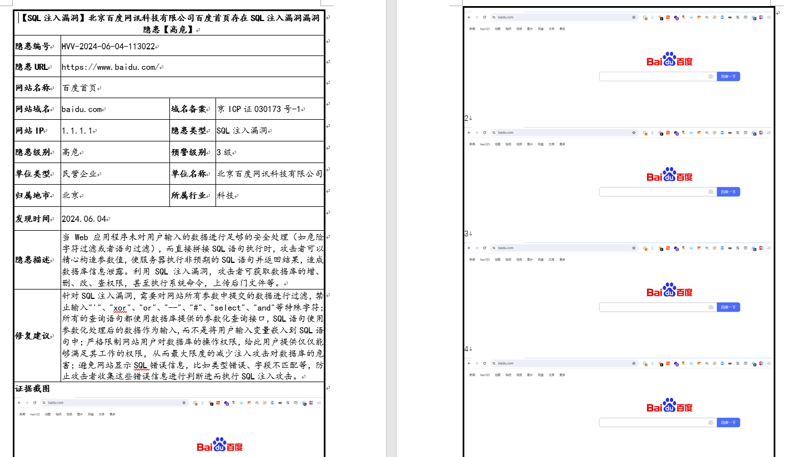

## 删除

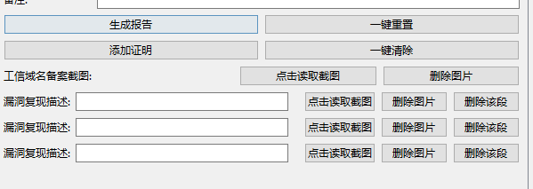

```
一键重置: 重置所有数据
一键清除: 仅删除所有漏洞附件及描述
```


# 二开

本项目只适用于当前模板，如果有需要可以对其再次二开，相应功能都已在代码中做注释。

除常规功能外，引入了一些特殊的功能

- 1、根据输入自动改变输出
  - 根据隐患级别自动改变预警级别
  
  - 根据单位名称、网站名称自动改变隐患名称和问题描述默认值
  
  - 根据隐患类型自动改变隐患名称、问题描述及整改建议
  
- 2、根据隐患URL自动提取根域名

- 3、针对漏洞复现添加单个或多个图文，相比前面几个，这个是最有意思且最复杂的。
